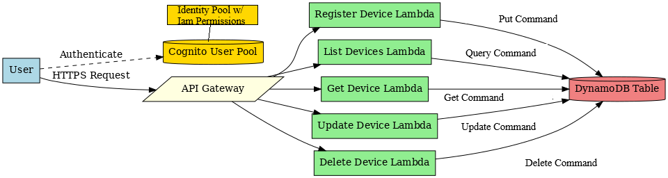

# HomeLink Interview Task

### Overview

This repo covers my solution to the HomeLINK take home tech task - full task details at bottom of the README.

This project uses the [SST framework](https://sst.dev/) to deploy an AWS serverless API.

### Hosted Version

Following the `getting started` steps below will deploy resources to your AWS account

If you would rather not deploy the api I will have it hosted at `api.homelink.nuvolaconsulting.co.uk` for the week and will have provided you with the credentials for some users in my email.

Note I have manually disabled signups for the hosted version, please use the provided credentials. Further, though not part of the IaC, the API will be rate limited.

## Get Started

The following steps assumes you have access to an AWS account with sufficient IAM permissions to provision. Further you will need the [AWS CLI](https://docs.aws.amazon.com/cli/latest/userguide/getting-started-install.html) installed on your machine.

1. Configure an [AWS profile](https://docs.aws.amazon.com/cli/latest/userguide/cli-configure-sso.html)

```
   $ aws configure sso
```

2. Clone repo and install packages

```
   $ git clone https://github.com/AHolwell/HomeLINK.git
   $ cd HomeLINK
   $ npm install
```

3. In `./sst.config.ts` replace the profile name with the one you set up.

```
   providers: {
      aws: {
         region: "eu-west-2",
         profile: "<YOUR_PROFILE_NAME>"
      }
   }
```

4. In `./infra/api.ts` replace the domain with one you have set up a hosted zone for in route 53 - alternatively remove the line to use an AWS generated domain.

```
domain: $app.stage === "production" ? "api.homelink.<YOUR_DOMAIN>" : undefined,
```

5. You can now get started with SST dev mode to run the lambda functions locally , or deploy the api fully.

   Note `sst dev` will still provision the supporting infrastructure (gateway, table, etc.)

```
   $ npx sst dev //local dev
```

```
   $ npx sst deploy --stage production //full deployment
```

6. Set up a user (or multiple). The resource IDs needed should have been output to your console after deployment

```
   $ aws cognito-idp sign-up \
      --region <COGNITO_REGION> \
      --client-id <USER_POOL_CLIENT_ID> \
      --username user@example.com \
      --password <PASSWORD>
      --profile <YOUR_PROFILE_NAME>
```

7. Confirm their password

```
   $ aws cognito-idp admin-confirm-sign-up \
      --region <COGNITO_REGION> \
      --user-pool-id <USER_POOL_ID> \
      --username user@example.com
      --profile <YOUR_PROFILE_NAME>
```

8. To test the endpoints, it is easiest to use [AWS API Gateway Test CLI](https://github.com/AnomalyInnovations/aws-api-gateway-cli-test) to navigate IAM Authorisation. This will have been installed with npm in step 2.

   Please find detailed commands in `./commands.md` and user credentials in the email.

## Usage

The infrastructure is defined in `./infra/`, split into:

- `api.ts` defines the APIGateway resources and routing
- `auth.ts` defines the Cognito resources, a user pool and identity pool
- `storage.ts` defines the DynamoDB table

The code is in `./packages/` is split into:

- `/functions` contains the lambda handlers for each route defined in the API
- `/core` contains supporting logic utilised by the handlers

I recommend starting with the lambda functions, and looking into the supporting code as it comes up.

## Tests

To run the unit tests navigate to `./packages/core`

```
$ cd packages/core
$ npm test
```

Note: The tests are ran via SST, a quirk of which means you'll need to have configured AWS as described above - though this won't provision anything.

## My Approach

### Assumptions

- The API itself is the product (i.e., it has no frontend) and will be made available to consumers to interact with directly - targeting custom home set ups for IoT hobbyists + enthusiasts who want to use the API to manage their device states.
- Though real time, the data is updated infrequently - ie. we're not streaming real time updates every second, but keeping track of things that change a few times a day.
- Different devices will have different functionality and information storage needs
  - You'll want to know and update the colour of your Light, but not of your Air Quality Sensor (probably)

### Tech Choices

#### AWS

I largely chose AWS to fit within the context of this being a technical test and the company's stack is AWS based. However a cloud based solution fits the needs of an IoT system by providing a lot of uptime reliability in the underlying infrastructure, as IoT devices can be in near constant connection.

Further, it provides easy scaling, high connectivity and asynchronous functionality, all of which greatly benefit an IoT system

##### Storage - DynamoDB:

I went with DynamoDB as my table storage. This is based off the assumption that this is regularly changed data, but not streamed data, as well as the assumption we'll want to store different fields for different devices. It handles frequent access well and the non-relational structure allows for as many fields unique to devices as we want without heavily impacting performance.

Further key-value pair is a natural fit for the data - users with different device IDs, each potentially associated with different field types. Playing into the first assumption, I didn't want to enforce unique device Ids between users, hence a range and hash key (user id and device key) was a natural fit.

Given the project's small scale, all data is stored in a single DynamoDB table, though if it were to massively scale there is an argument for different tables for different device categories.

##### Compute - API Gateway + Lambdas

Each endpoint only needs to run a small bit of logic, validate the request and execute the change in the database. Such small snippets are perfect for lambdas. Further the asyncrhonous, idempotent, and scalable nature of lambdas is a good fit for the IoT environment.

Further a RESTful API through API Gateway was a suitable approach for the asynchronous communication and operations.

##### Auth - Cognito

We want users to only be able to access their devices, even though they are all going to be stored in the same place, Cognito user and identity pools provide a convenient and trusted manner of controlling access.

#### SST Framework

I used the SST framwork and tooling to handle IaC + deployment cleanly and quickly for a small serverless project. Local development mode is an amazing tool for debugging lambdas without too much friction. As well as hopefully eliminate the chance of being hit with an '_it works on my machine_' scenario by hosting it myself..

#### NodeJs + Typescript

I like static types, and SST is built around typescript.

#### Zod

The majority of my input validation and sanitisation is done via Zod. Its an extremely powerful, elegant and useful tool.

## Design Documentation

### Architecture

It's a standard serverless design. An API gateway with 5 routes to 5 lambdas to handle each bit of functionality (delete, get, list, register, update). The lambdas validate the request and interact with the DynamoDB, then confirm the results via HTTP response back through the gateway.

Cognito sits in front of the gateway to authorise requests, and the database is only accessable via the API endpoints.

The requests are authorised via the Cognito User being assigned IAM permissions to access the API. Further the cognito user id is used as the database hash key.



### Data Structures

As has been touched on, the userId from cognito is the database _hash key_, then the user can pass in device Ids via the register endpoint to use as the _range key_. The unique combination of the two is used for the tables primary indexing.
However, as far as the user is concerned, they dont need to interact with their userId, their device Ids are all that is needed for querying the table.

For the rest of the data stored about a device. I have a base device Zod Schema (`./packages/core/src/schema/BaseDevice`) which stores information all devices in the table will have. In essence it is what I am considering the base functionality and registration details of all IoT devices. This is then extended into specific device categories. Such as the two I have supported `Light` and `Carbon Monitor`. These have extra information on top of the base device specific to their functionality, such as `colour` and `intensity` for lights.

While I support specific device categories, I allow any string to be used as the device category to support the users in using the api for their custom devices - in accordance with my first assumption. Each schema also comes with which fields the API will allow the user to update after registration. These are the fields related to ongoing functionality such as `isPowered` or customisation such as `deviceName`.

For the lowest friction device registration, and codebase simplicity, you cant set any customisation options during the registration request, you can only provide the registration information. The customisation options currently default to hardcoded values. Though, if it was appropriate, the defaults can be trivially replaced by functions to derive the initiation values.

### Requests

All requests must come in as a JSON object stringified into the body of the HTTPS API request. Refer to `commands.md` for examples and `./packages/core/src/parsing/schema/requestBodies.ts` for the request schema. The update request schema can be found in `./packages/core/src/schema` as it is device category specific.

Note that the device id is always pulled from the route, not the request body.

## Codebase Documentation

##### Lambdas

`./packages/functions` contains only the code directly within the lambdas in keeping with the SST frameworks filesystem structure.

Each lambda's code is generally structured into five parts.

1. It validates and sanitises the request through Zod schemas.
2. Uses the validated data to construct the dynamoDB client command.
3. Then executes said command.
4. Checks the database response if appropriate.
5. Returns stringified result.

`register.ts` slightly deviates from the others as the command is constructed from the device schema.

`update.ts` deviates slightly further as it accesses the table twice. The first access being a retrieval of the device category to construct the correct subsequent update command.

##### Supporting Code

`./packages/core` contains the rest of the code that the lambdas utilise, the dependencies such as Zod and Vitest are installed into this package only.

- `./core/src/devices` holds the functions to create the device object during registration, and to construct the device's DynamoDB update expression when their state changes. Notably this functionality is intentionally device agnostic.

- `./core/src/errors` holds extensions of the Error class for some custom error handling, as well as some boilerplate code to reformat zod errors to present them to my users in a more readable fashion.

- `./core/src/functions-tests` holds the unit tests for the lambdas, note that Vitest is not installed in the `./packages/functions` package, this is SST best practice to keep it lightweight. Hence the tests are stored here.

- `./core/src/parsing` holds the functionality that validates and sanitises the user inputs, and constructs my typed objects based off the schema. Again this package is device agnostic and pulls device schemas when it needs them.

- `./core/src/schema` holds the specifics about the device categories I support.
  I treated it as if it were an external package, because in a real use case it should be, so it can be locked down more strongly than the api code. Further all the API code should be agnostic of the device schemas pulling them when needed for easy scalability into supporting more devices.
  To support another device you need only add its schema as detailed in the README.txt within.

- `./core/src/util` holds a wrapper for my lambda functions to consistently handle error catching and formatting the http response to send back through the gateway.

### Notable decisions/challenging points

- Designing the code to be agnostic of the device it was working with was an interesting architectual point. Especially as I wanted to support any category with the base device, I needed to be carefuly to always be mapping to the correct schema and maintain my typing integrity.

- As I chose to expose certain error messages to the user it was a good exercise in handling my errors carefully, to make sure my error messages were helpful, but had no risk of data leakage. This lead to the ValidationError and InternalError extensions. I'll feedback any Validation Errors but log Internal Errors and respond with a generic error message. (I havent actually implemented any logging, but I would)

- How to handle conflicting/repeated requests was also an interesting point. Especially in relation to the above - e.g., when trying to delete a non-existant device, should I tell the user it wasnt there, or just confirm that there _now_ isn't that device.

- Input validation and sanitisation was another big concern, as I am putting user input into DynamoDb commands, though most of this was easily handled via Zod stripping fields I'm not explicitly allowing and enforcing other restrictions.

### Expansion/ Next Steps

- There is an argument for dropping the user id from the device data returned form a saftey standpoint as the user should never interact with it, they dont need it know its there.

- For this to actually work as an IoT system API, there would need to be some way for the device to actually respond to the change to its state in the table. The way I imagined that would fit with my current design would be lambdas triggered by changing data sending the update to the connected device.

  - As ever, you would need to be very careful about not letting this lambdas cause a loop.

- Alternatively for less time critical devices periodically checking for table updates and pushing them. This would eliminate the loop issue but would likely be far less responsive

- There are also some testing gaps in my unit tests to be filled, further functional tests with mock databases would be a great addition

### Known Issues

- The Zod safeParse seems to crash out when the string max length is not adhered to, wrapping in a try catch does not fix the issue. Strangely it works fine for everything else. It is currently handled as an Internal Error.

- Not necessarily an issue, but misspelt optional fields in requests will just be stripped without clear notice to the user.

## The Task Description

### Overview

Welcome to the future of home automation! Your mission is to build a backend system acting as the central hub for managing IoT devices in a smart home environment. These IoT devices might include anything from smart lights to thermostats or security cameras. Your task is to create a RESTful web API that allows users to manage these devices, monitor their status, and control them remotely.

This task is designed to test your ability to design and implement a backend system with a focus on RESTful APIs, managing state, and handling real-time data in an IoT context.
Objectives:

- Create IoT Device Management API:

- Register a New Device:

  - Create an endpoint to register a new IoT device. The API should accept the necessary details to uniquely identify and describe the device.
    The response should return the details of the registered device, including a unique identifier.

- List All Devices:

  - Implement an endpoint to retrieve a list of all registered devices. This endpoint should return a summary of each device's details.

- Get Device Details:

  - Create an endpoint to retrieve the details of a specific device by its unique identifier.

- Update Device Status:

  - Provide an endpoint to update the status or configuration of a specific device. This could be used, for example, to turn a light on or off, adjust a thermostat, etc.
  - The response should confirm the updated status or configuration.

- Delete a Device:
  - Implement an endpoint to delete a specific device from the system. The response should confirm the deletion.

### Requirements:

- Use any backend technology stack you are comfortable with (e.g., Node.js, Python, Ruby, etc.).
- Use any form of data storage (in-memory database, relational database, file storage, etc.) to manage device state and history.
- Write clean, maintainable code with appropriate documentation.
- Include error handling for common edge cases (e.g., invalid device IDs, bad input data).

### Deliverables:

- A link to your public GitHub repository with the project code.
- A README file with instructions on how to run the project, including any assumptions you made.
- (Optional) A brief summary of your approach and any interesting challenges you encountered.

Good luck on your mission to make smart homes even smarter! The future of home automation is in your hands.
